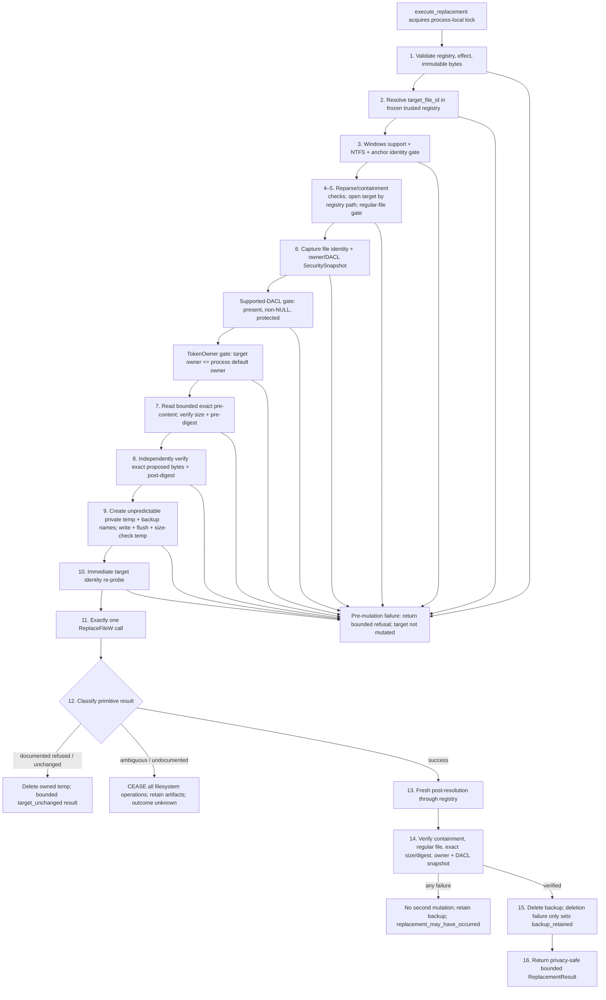

# Constrained Replacement Sequence

## Status and Verification Basis

**Level 3 — implemented reviewer sequence, disconnected from the current runtime.**
Verified against local `main` at `6d585268` on 2026-08-01. Re-pinned after CR-DD-013's
documentation-only closeout; no production, test, workflow, schema, or architecture file
changed between the two pins. The executor is Windows/NTFS specific and no current runtime
module calls it.

## Claim Supported

`execute_replacement` orders its checks so unsupported or unstable targets cease before the
single mutation call, invokes `ReplaceFileW` at most once, performs no further filesystem
mutation after an ambiguous mechanism result, and reports verified success only after fresh
post-resolution plus exact content and participating security-metadata verification.

## Load-Bearing Ordering

### Before mutation

1. Validate typed inputs and reject equal pre/post digests.
2. Resolve only through `target_file_id` in `MediatedTargetRegistry`.
   `effect.canonical_relpath` is evidence consistency, never a path-resolution channel.
3. Fail closed off Windows, without Win32 support, off NTFS, or when the anchor changed.
4. Reject reparse ancestors and target reparses before opening the target.
5. Verify final path, containment, and regular-file type.
6. Capture original file identity and a core-owned `SecuritySnapshot`.
7. Refuse unless the DACL is present, non-NULL, and protected. The executor never edits a
   DACL to make the target eligible.
8. Compare the target owner with the process token's default owner—the owner the temporary
   file will actually receive.
9. Read bounded exact bytes and verify the expected pre-digest.
10. Re-verify the proposed bytes independently; typed effect construction is not treated as
    proof that these invocation bytes were checked.
11. Prepare the same-directory private temporary file, flush it, and verify its size.
12. Re-probe target identity immediately before mutation. This narrows but does not close
    the name-resolution race.

### Mutation point

Step 11 in the code's accepted sixteen-step sequence issues at most one `ReplaceFileW` call.
There is no retry, path-based fallback, or automatic rollback.

### After mutation

- Documented intact-name refusal codes permit owned-temp cleanup and a
  `target_unchanged` result.
- Any undocumented or ambiguous primitive outcome causes immediate cessation. No cleanup
  mutation occurs; artifacts are retained for human recovery.
- Reported primitive success triggers a fresh registry-based resolution. The executor does
  not reuse the pre-replacement handle or identity.
- Content, size, type, containment, owner, DACL state/control, ACL revision, ACE count, and
  ordered complete ACE bytes are checked. The only bounded metadata exception permits
  `SE_DACL_AUTO_INHERITED` to move `False → True`; `True → False` remains failure.
- Any post-check failure reports that replacement may have occurred and retains the backup.
- Backup deletion happens only after full verified success. Deletion failure does not
  downgrade the verified content/metadata result; it sets `backup_retained=true`.

## Cessation Semantics

| Observation point | Permitted next action |
| --- | --- |
| Any failed precondition before `ReplaceFileW` | Return bounded refusal; clean only owned pre-mutation temp where specified |
| Documented refusal that retains original names | Delete owned temp; return unchanged classification |
| Ambiguous `ReplaceFileW` result | Perform no more filesystem operations |
| Successful primitive but failed post-verification | Perform no second mutation; retain backup; return ambiguous bounded result |
| Fully verified post-state | Delete backup once; return privacy-safe result |

## Authoritative Sources Verified

- `triage_core/mediated_executor.py`: `execute_replacement`, `_execute_locked`,
  `_execute_on_windows`, `_mutate`, `_verify_post_state`,
  `classify_replace_result`, `snapshot_from_capture`,
  `compare_security_snapshots`, `ReplacementResult`
- `triage_core/mediated_executor_win32.py`: anchored path walking, security capture,
  token default-owner query, private temporary file operations, and the `ReplaceFileW`
  adapter
- `triage_core/mediated_effect.py`: exact proposed-byte verification reused by the executor
- `tests/test_mediated_executor.py`, including ordering/cessation, path containment,
  DACL/owner preservation, one-call, ambiguity, exact-byte, and privacy projections

## Non-Claims

- No claim that the executor is wired to authorization, reservation, capability claiming,
  `tc run`, or ledger persistence.
- No claim of cross-process locking; `_EXECUTION_LOCK` is process-local only.
- No claim that the identity re-probe eliminates the target-name race.
- No claim of automatic rollback after mutation.
- No claim of support for unprotected, absent, or NULL DACLs.
- No claim of non-Windows or non-NTFS execution.
