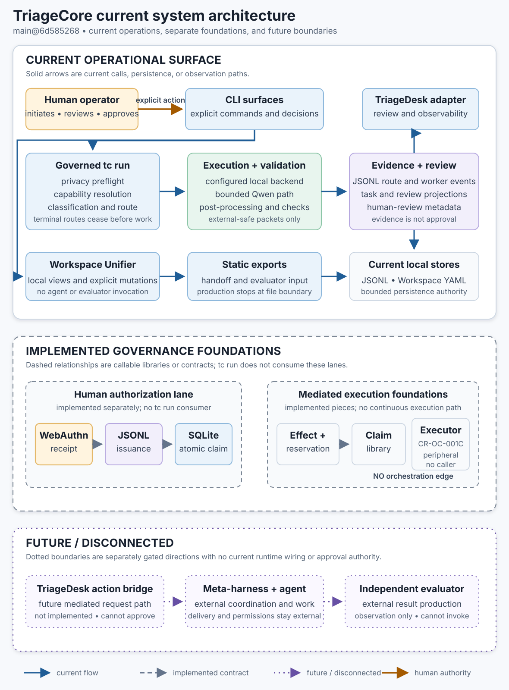

# Current System Architecture

## Status and Verification Basis

**Level 1 — current system architecture.** Verified against local `main` at
`6d585268` on 2026-08-01. Re-pinned after CR-DD-013's documentation-only closeout; no
production, test, workflow, schema, or architecture file changed between the two pins.
This page distinguishes current integrated paths,
implemented-but-disconnected foundations, and conceptual or external actors.

The SVG is a presentation rendering of this page. This Markdown is authoritative if the
two drift.

## Claim Supported

TriageCore currently provides an integrated CLI-to-governed-run path, local evidence and
review projections, Workspace Unifier state and static exports, a read/observability
TriageDesk adapter, and separate human-authorization primitives. The mediated effect,
reservation, capability-claim, and constrained replacement components are implemented on
`main`, but no current runtime module composes them into one end-to-end execution path.

## Integration Status

| Area | Status | Current boundary |
| --- | --- | --- |
| `tc run` | Current and integrated | Packet preflight, capability resolution, classification, resilience routing, terminal-route handling, backend execution, validation, and ledger evidence |
| Local backend | Current when configured | Invoked through `TriageEngine.execute_task` |
| Qwen Cloud backend | Current but optional | Only receives an `ExternalSafeTaskPacket`; disabled or unconfigured routes terminate as handoff |
| Deterministic route | Selected by policy, executor disconnected | `tc run` returns `handoff_required`; no deterministic executor is wired into the governed loop |
| Human-handoff route | Current terminal route | Stops before backend invocation and records `worker_result_status=not_attempted` when a ledger is present |
| Review queue | Current projection | Derived from JSONL events where `human_review_required` is true and no review decision exists |
| Workspace Unifier | Current subsystem | Local YAML views, explicit mutations, static dashboard, handoff, and evaluator-input exports |
| TriageDesk adapter | Current review/observability surface | Reads diagnostics, ledger projections, context plans, and packet previews; no action/executor bridge |
| TriageDesk action/executor bridge | Future and disconnected | Not implemented. A later separately governed bridge could translate explicit operator actions into mediated execution requests; it would have no independent approval authority. |
| Human authorization + capability lifecycle | Implemented separate lane | WebAuthn-backed receipts, issuance evidence, atomic SQLite claiming, and terminal state; not consumed by `tc run` |
| Mediated effect + request reservation | Implemented but disconnected | Pure effect/request/linkage contracts and an atomic reservation store with gated authorization wrappers |
| Constrained replacement executor | Implemented but disconnected | Windows/NTFS single-file `ReplaceFileW` executor; no runtime module calls it |
| Meta-harness, bounded agents, independent evaluator | Conceptual or externally operated | TriageCore emits static artifacts; delivery, execution, and evaluator result production stay external |

## Authority and Persistence

| Store or surface | Authority it owns | Authority it does not own |
| --- | --- | --- |
| JSONL task ledger | Durable event evidence and review projections | Concurrency lock, human identity proof, atomic capability ownership |
| `capability_claims.sqlite3` | Atomic claim owner, execution-attempt binding, and lifecycle state | Human approval, receipt authenticity, execution correctness, ledger integrity |
| Request-reservation SQLite store | Client-request ownership, one-shot issuance gate, capability binding, reservation lifecycle | Broker authenticity, human approval, execution occurrence |
| Workspace YAML | Operator-maintained work state and focus | Agent execution or approval |
| Receipt sidecar | Full WebAuthn assertion artifact for offline verification | Approval of any bytes not bound into its request |
| TriageDesk adapter | Presentation of state and evidence; no action bridge | Operator command, approval, or execution authority |
| CLI surfaces | Explicit operator commands and review decisions where implemented | Independent approval authority or implicit permission to execute disconnected components |
| Human operator | Consequential approval decision | Automatic proof that implementation or evaluation is correct |

## Key Separation Rules

1. Route selection and backend execution are separate stages.
2. Capability evidence resolution distinguishes observation from configured declaration.
3. `human_review_required` can populate the review queue without blocking an otherwise
   selected automated route. A `human_handoff` terminal route does block worker invocation.
4. SQLite owns atomic capability state; the JSONL ledger records durable evidence after the
   state transition.
5. Static handoff and evaluator-input exports do not prove delivery, execution, or result
   production.
6. The mediated components have contract relationships, not a current continuous
   orchestration edge.

## Progressive Zoom

- **Level 2:** [Workspace Unifier Architecture](workspace_unifier_architecture.md)
- **Level 3:** [Current Governed Run Flow](governed_run_flow.md)
- **Level 3:** [Human Authorization and Atomic Capability Lifecycle](human_authorization_lifecycle.md)
- **Level 2/3:** [Mediated Execution Foundations](mediated_execution_foundations.md)
- **Level 3:** [Constrained Replacement Sequence](constrained_replacement_sequence.md)
- **Level 3:** [Workspace Unifier Flow](workspace_unifier_flow.md)

## Authoritative Sources Verified

- `triage_core/tc_cli.py`: `tc_run`
- `triage_core/client.py`: `TriageClient.run_task`,
  `TriageClient._build_resilience_route_input`, `TriageClient._execute_cloud_task`
- `triage_core/capability_evidence.py`: `resolve_capability`, `resolve_from_config`
- `triage_core/routing/resilience_router.py`: `choose_resilience_route`
- `triage_core/engine.py`: `TriageEngine.execute_task`
- `triage_core/task_ledger.py` and `triage_core/review_queue.py`
- `triage_core/triagedesk_adapter.py`
- `triage_core/workspace_*.py` and `schemas/workspace_*.schema.json`
- `triage_core/authz.py`, `triage_core/fido2_adapter.py`, and
  `triage_core/capability_claims.py`
- `triage_core/mediated_effect.py`, `triage_core/request_reservation.py`,
  `triage_core/mediated_executor.py`, and `triage_core/mediated_executor_win32.py`
- Focused tests in `tests/test_capability_binding.py`, `tests/test_client.py`,
  `tests/test_authz.py`, `tests/test_capability_claims.py`,
  `tests/test_request_reservation.py`, `tests/test_mediated_effect.py`,
  `tests/test_mediated_executor.py`, `tests/test_triagedesk_adapter.py`, and
  `tests/test_workspace_*.py`

## Non-Claims

- This does not claim the mediated components are called by `tc run`.
- This does not claim TriageDesk can authorize or execute work.
- This does not claim a meta-harness, bounded agent, or evaluator is deployed by this repo.
- This does not claim every `human_review_required` record blocks backend execution.
- This does not claim SQLite replaces ledger evidence or that the ledger provides atomic
  ownership.
- This does not claim broad frontier-provider support beyond the bounded Qwen path.

## Limitations and Drift

- This diagram describes repository integration, not host deployment, network topology, or
  operator practice.
- `main@6d585268` is the evidence pin. Re-verify call sites and import relationships when the
  pin changes.
- Detailed pages and tests remain authoritative for ordering and reason-code behavior.
