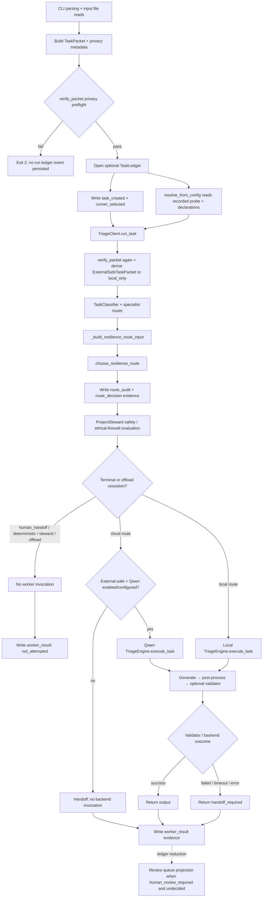

# Current Governed `tc run` Flow

## Status and Verification Basis

**Level 3 — current runtime function/sequence diagram.** Verified against local `main` at
`6d585268` on 2026-08-01. Re-pinned after CR-DD-013's documentation-only closeout; no
production, test, workflow, schema, or architecture file changed between the two pins.

## Claim Supported

The current `tc run` command preflights privacy before its first ledger write, resolves
already-recorded local capability evidence without probing, separates route choice from
backend execution, stops terminal routes before worker invocation, and records route/worker
evidence when a ledger is enabled.

## Read Versus Write Boundaries

| Stage | Reads | Writes |
| --- | --- | --- |
| CLI input assembly | Explicit input files and inline data | None |
| Initial privacy preflight | In-memory `TaskPacket` | None; failure occurs before ledger initialization/events |
| Capability resolution | Config plus an optional already-recorded probe JSON file | None; it never probes, invokes a model, or records a new observation |
| Route decision | Packet metadata, task classification, capability resolution, static cloud configuration | `route_audit` and `route_decision` events when the ledger is enabled |
| Worker | Selected local backend or bounded Qwen backend | Backend side effects are limited to the backend call; `worker_result` evidence follows |
| Output | In-memory result | Optional explicitly named output file |
| Review queue | JSONL ledger projection | None |

## Observation Versus Declaration

`resolve_capability` applies this precedence:

1. A fresh observed-unavailable record suppresses dependent local routes and cannot be
   overridden by declarations.
2. A fresh reachable observation proves runtime reachability only.
3. `local_fast` and `local_heavy` route-class availability require explicit declarations.
4. A declaration without usable observation is recorded as configured, never observed.
5. No usable observation and no declaration leaves local capability unknown/unavailable.

`tc run` always supplies this resolution to `_build_resilience_route_input`. Direct library
callers that omit `capability` retain legacy optimistic local-availability defaults; that is
not the CLI behavior.

## Route Choice Versus Execution

`choose_resilience_route` returns a route decision and review metadata. It does not invoke a
backend. `TriageClient.run_task` then interprets that decision:

- `human_handoff`: terminal; no worker call.
- `deterministic`: terminal in the governed loop because no executor is wired.
- `cloud_primary` or `cloud_secondary`: can invoke Qwen only with an
  `ExternalSafeTaskPacket` and enabled configuration.
- `local_heavy` or `local_fast`: invokes the configured local engine.

Local-only packets fail closed if the chosen route is not proven local or the specialist
router recommends offload.

## Review Metadata Is Not a Universal Gate

`choose_resilience_route` sets `human_review_required` for medium/high sensitivity and for
certain fallback choices. That value is written into route evidence and later projected by
`get_pending_reviews`. It does **not** universally stop an otherwise selected local or cloud
backend. The actually blocking path in this flow is selection of the `human_handoff` route,
or another explicit terminal/fail-closed condition.

## Failure Cessation Points

- Initial privacy failure: exit before ledger event persistence.
- Unsafe packet or unavailable local-only route: exit 2; no worker invocation.
- Steward insufficiency, terminal route, or offload recommendation: append a
  `not_attempted` worker result and return handoff.
- Missing cloud safety/configuration: return handoff before cloud generation.
- Validator failure: worker ran, but output becomes a handoff rather than success.
- Backend timeout/error/invalid output: return bounded failure/handoff evidence.
- `--no-ledger`: execution can proceed with an explicit warning, but no ledger-backed review
  projection exists for that run.

## Authoritative Sources Verified

- `triage_core/tc_cli.py`: `tc_run`
- `triage_core/safe_task_packet.py`: `verify_packet`, `make_external_safe_packet`
- `triage_core/capability_evidence.py`: `resolve_capability`, `resolve_from_config`
- `triage_core/client.py`: `TriageClient.run_task`,
  `TriageClient._build_resilience_route_input`, `TriageClient._execute_cloud_task`
- `triage_core/classifier.py` and `triage_core/routers.py`
- `triage_core/routing/resilience_router.py`: `choose_resilience_route`
- `triage_core/engine.py`: `TriageEngine.execute_task`
- `triage_core/task_ledger.py`: `TaskLedger._apply_event`
- `triage_core/review_queue.py`: `get_pending_reviews`
- Focused tests: `tests/test_capability_binding.py`, `tests/test_cli.py`,
  `tests/test_local_only_routing.py`, `tests/test_qwen_cloud_routing.py`, and routing/client
  tests under `tests/`

## Non-Claims

- No claim that review metadata is an approval token or universal execution gate.
- No claim that capability resolution performs a live health probe.
- No claim that the deterministic route executes a deterministic tool in `tc run`.
- No claim that a successful worker result is human-approved.
- No claim that `tc run` consumes the WebAuthn/capability lifecycle described in
  [Human Authorization and Atomic Capability Lifecycle](human_authorization_lifecycle.md).
