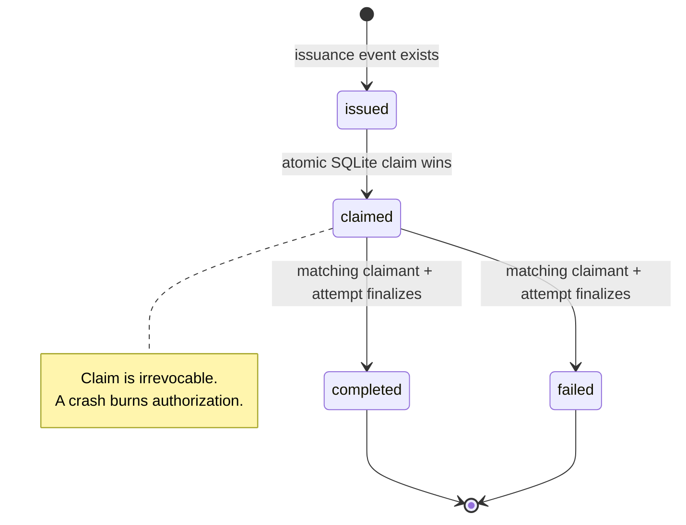

# Human Authorization and Atomic Capability Lifecycle

## Status and Verification Basis

**Level 3 — implemented separate runtime lane.** Verified against local `main` at
`6d585268` on 2026-08-01. Re-pinned after CR-DD-013's documentation-only closeout; no
production, test, workflow, schema, or architecture file changed between the two pins.
This lane is not consumed by current `tc run`.

## Claim Supported

TriageCore can bind a human WebAuthn assertion to one canonical authorization request,
record a digest-linked receipt, issue a one-use capability, atomically assign claim
ownership in SQLite, and enforce absorbing `completed` or `failed` terminal states while
keeping the JSONL ledger as evidence rather than a concurrency lock.

```mermaid
sequenceDiagram
    actor Human as Human operator
    participant Caller as Authorization caller
    participant Authz as triage_core.authz / fido2_adapter
    participant WebAuthn as WebAuthn platform + credential store
    participant Ledger as JSONL ledger + receipt sidecar
    participant Store as CapabilityClaimStore (SQLite)
    participant Exec as Separate execution caller

    Human->>Caller: Approve exact task / decision / artifact / scope digests
    Caller->>Authz: Construct AuthorizationRequest + compute_challenge
    Authz->>WebAuthn: get_assertion_receipt(request, credential)
    WebAuthn->>Human: User presence / verification ceremony
    WebAuthn-->>Caller: HumanAuthorizationReceipt value
    Caller->>Authz: verify_receipt(receipt, request, credential store)
    Authz->>WebAuthn: Complete assertion verification
    WebAuthn-->>Authz: Verified enrolled credential
    Caller->>Authz: record_receipt(...)
    Authz->>Ledger: Sidecar receipt + metadata/digest event
    Caller->>Authz: issue_capability(...)
    Authz->>Ledger: execution_capability_issued
    Note over Ledger,Store: Issuance evidence is durable history; it is not the atomic lock
    Exec->>Authz: claim_capability(...)
    Authz->>Ledger: Find exactly one compatible issuance; verify bindings / expiry
    Authz->>Store: BEGIN IMMEDIATE; issued → claimed
    Store-->>Authz: Committed owner + execution_attempt_id
    Authz->>Ledger: Append capability_claimed evidence
    Authz-->>Exec: Winning claim
    alt execution completed
        Exec->>Authz: finalize_capability(completed)
        Authz->>Store: claimed → completed
        Authz->>Ledger: Append terminal evidence
    else execution failed or abandoned
        Exec->>Authz: finalize_capability(failed)
        Authz->>Store: claimed → failed
        Authz->>Ledger: Append terminal evidence
    end
```



`issued` is evidenced in the ledger. `CapabilityClaimStore.claim` materializes the immutable
binding as `issued` inside the winning `BEGIN IMMEDIATE` transaction and transitions it to
`claimed` before commit; SQLite does not maintain a separately claimable pool before that
transaction.

## Authority Split

| Component | Authoritative for | Not authoritative for |
| --- | --- | --- |
| `AuthorizationRequest` | Exact canonical request fields and challenge digest | Identity proof or execution |
| WebAuthn verification | Enrolled/non-revoked credential, RP/origin, challenge, presence/UV policy, assertion signature | Correctness of the authorized operation |
| Receipt sidecar | Full assertion artifact used for offline re-verification | Atomic claim ownership |
| JSONL ledger | Receipt/issuance/claim/terminal evidence and immutable binding history | Concurrency locking or current atomic lifecycle state |
| `CapabilityClaimStore` SQLite | Atomic owner, execution attempt, current lifecycle state, and legal terminal transition | Human approval, receipt authenticity, plan correctness, execution quality, ledger integrity |

## Ordering and Cessation

1. `AuthorizationRequest` normalizes and validates every bound field before canonical
   hashing. Prompt or file contents do not belong in it.
2. `get_assertion_receipt` requests a WebAuthn assertion over
   `SHA-256(canonical_json(request))`.
3. `verify_receipt` performs structural checks, credential enrollment/revocation and
   approver-identity checks, then full `Fido2Server.authenticate_complete` verification.
   Failure stops before capability issuance.
4. `record_receipt` writes a restrictive sidecar and a metadata/digest-only ledger event.
5. `issue_capability` appends one-use issuance evidence. Its caller is responsible for
   completing receipt verification first.
6. `claim_capability` finds exactly one issuance, checks expiry and digest bindings, then
   calls `CapabilityClaimStore.claim`.
7. SQLite commits `issued → claimed` before claim evidence is appended. If that append
   fails, the capability remains burned and the caller receives
   `claim_evidence_write_failed`; it must not execute.
8. `finalize_capability` commits `claimed → completed|failed` for the same claimant and
   execution attempt, then appends terminal evidence. A terminal evidence-write failure
   does not reverse the SQLite state.

The schema itself constrains row shape, immutable bindings, legal transitions, claim-owner
immutability, terminal metadata immutability, and non-deletion of claimed/terminal rows.

## Human Authorization Versus Review Metadata

This lane produces a cryptographically bound authorization receipt and a one-use capability.
It is distinct from `human_review_required` in route evidence. The latter can place a task in
the review queue; it is not a WebAuthn receipt, a capability, or proof that an execution gate
was satisfied.

## Authoritative Sources Verified

- `triage_core/authz.py`: `AuthorizationRequest`, `compute_challenge`,
  `HumanAuthorizationReceipt`, `verify_receipt_structure`, `record_receipt`,
  `issue_capability`, `claim_capability`, `finalize_capability`, `consume_capability`
- `triage_core/fido2_adapter.py`: `get_assertion_receipt`, `verify_receipt`
- `triage_core/capability_claims.py`: `CapabilityBinding`, `CapabilityClaimStore.claim`,
  `CapabilityClaimStore.finalize`, schema checks and triggers
- `triage_core/task_ledger.py`
- `tests/test_authz.py` and `tests/test_capability_claims.py`
- Change records: `docs/change/requests/CR-YK-001-hardware-authorization-receipts.md`
  and `docs/change/requests/CR-YK-002-atomic-capability-claiming.md`

## Non-Claims

- No claim that `tc run` uses this authorization lane.
- No claim that a valid receipt proves execution correctness or acceptance.
- No claim that ledger order provides atomic claim ownership.
- No claim that SQLite proves human identity, approval, or receipt authenticity.
- No claim that a failed or crashed execution returns the capability to `issued`.
- No claim that local SQLite locking is safe over NFS, SMB, cloud-synced folders, or
  unusual FUSE mounts.
