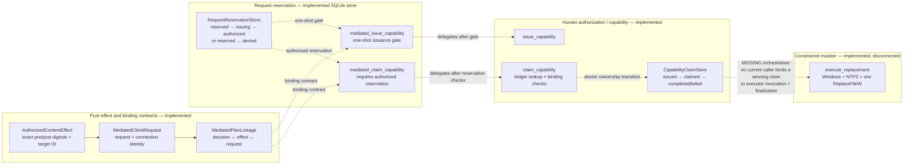

# Mediated Execution Foundations

## Status and Verification Basis

**Level 2/3 — implemented but disconnected foundations.** Verified against local `main` at
`6d585268` on 2026-08-01. Re-pinned after CR-DD-013's documentation-only closeout; no
production, test, workflow, schema, or architecture file changed between the two pins. No
current runtime module imports these pieces to form one complete execution workflow.

## Claim Supported

TriageCore contains bounded contracts for an exact content effect, atomic request
reservation and capability binding, atomic capability claiming, and a constrained Windows
replacement executor. Their individual contracts and selected wrapper relationships are
implemented. The orchestration edge that would claim authority, call the executor, and
finalize the capability is missing.



All cross-subsystem edges are dashed deliberately. They are contract or wrapper
relationships, not a current continuously wired runtime.

## Foundation Responsibilities

### Exact effect contract

`build_authorized_effect` verifies UTF-8 as a gate without normalization, exact proposed
byte length, and the expected post-content digest. `AuthorizedContentEffect` retains only
metadata and digests. `build_client_request`, `build_plan_linkage`, and
`capability_binding_fields` verify that the effect, request, connection, task, and decision
describe one transition before projecting capability bindings.

### Atomic request reservation

`RequestReservationStore` owns client-request uniqueness, broker-connection binding, the
one-shot right to start issuance, and binding exactly one capability to exactly one request.
Its lifecycle is:

```text
reserved → issuing → authorized
        \→ denied
```

`mediated_issue_capability` verifies the effect/request/linkage/receipt binding, wins
`reserved → issuing`, then calls `issue_capability`, then binds the issued capability. If
issuance or binding fails, the reservation never returns to `reserved`.

`mediated_claim_capability` verifies an authorized reservation and matching capability
before delegating to the atomic claim function. It does not make direct capability callers
subject to reservation policy.

### Atomic capability lifecycle

`CapabilityClaimStore` owns atomic claim ownership and terminal state. See
[Human Authorization and Atomic Capability Lifecycle](human_authorization_lifecycle.md).

### Constrained replacement

`execute_replacement` performs an isolated, process-local, single-file Windows replacement
with strict preconditions and post-verification. It imports no authority or store module.
See [Constrained Replacement Sequence](constrained_replacement_sequence.md).

## Missing Orchestration Edge

No current module performs this complete sequence:

```text
receive mediated request
→ reserve and authorize it
→ atomically claim capability
→ invoke execute_replacement with the exact claimed effect/bytes
→ finalize capability completed|failed
→ append one joined execution evidence record
```

Repository verification found no runtime call site outside the defining modules for
`execute_replacement`, `mediated_issue_capability`, or `mediated_claim_capability`. Tests
also enforce that current runtime modules do not import the executor modules.

## Authority Separation

| Component | Owns | Does not own |
| --- | --- | --- |
| `AuthorizedContentEffect` | Pure description and digest of one exact content transition | File resolution, authority, persistence, or execution |
| `RequestReservationStore` | Request ownership, replay/reuse classification, one-shot issuance gate, capability binding | Human identity, broker authenticity, execution occurrence |
| `CapabilityClaimStore` | Atomic execution claimant and lifecycle | Effect correctness or filesystem mutation |
| `execute_replacement` | One bounded filesystem mechanism and verified result | Human authorization, request reservation, capability claim, ledger writing |

## Authoritative Sources Verified

- `triage_core/mediated_effect.py`: `AuthorizedContentEffect`,
  `build_authorized_effect`, `build_client_request`, `build_plan_linkage`,
  `assert_linkage_binds`, `capability_binding_fields`
- `triage_core/request_reservation.py`: `RequestReservationStore`,
  `mediated_issue_capability`, `mediated_claim_capability`
- `triage_core/capability_claims.py`: `CapabilityClaimStore`
- `triage_core/authz.py`: `issue_capability`, `claim_capability`,
  `finalize_capability`
- `triage_core/mediated_executor.py`: `execute_replacement`
- `triage_core/mediated_executor_win32.py`
- `tests/test_mediated_effect.py`, `tests/test_request_reservation.py`,
  `tests/test_capability_claims.py`, and `tests/test_mediated_executor.py`

## Non-Claims

- No claim of an end-to-end mediated runtime.
- No claim that `tc run` uses any mediated foundation.
- No claim that an authorized reservation automatically claims a capability.
- No claim that a claimed capability automatically invokes or finalizes an executor.
- No claim that `execute_replacement` verifies human authority or writes ledger evidence.
- No claim that process-local executor locking provides cross-process exclusion.
