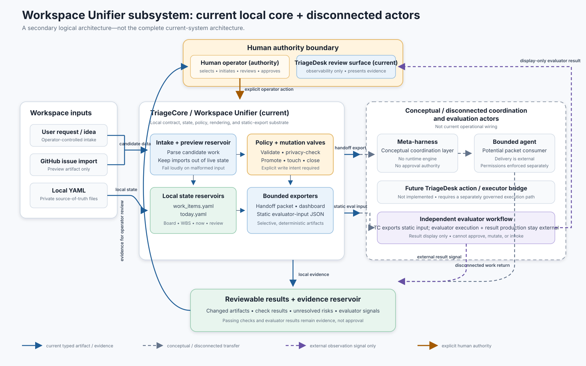

# Workspace Unifier Architecture

## Status

Subsystem-specific logical architecture for the Workspace Unifier. This document describes
existing boundaries and the intended relationship between TriageCore, TriageDesk, a
conceptual meta-harness, bounded agents, and an independent evaluator. It does not
authorize new runtime behavior, create an approval path, or claim that all depicted
components are deployed or operationally wired.

This is a secondary subsystem diagram, not the repository's sole
`current_system_architecture.svg`. A broader current-system diagram should contain the
Workspace Unifier as one TriageCore subsystem.



The companion SVG is a presentation rendering of this document. If the two drift, this
Markdown is authoritative.

## Purpose

The Workspace Unifier reduces the cost of resuming and handing off work while keeping
state, execution, evaluation, and approval separate. Its design is local-first and
artifact-mediated: context crosses a boundary through a narrow, reviewable packet rather
than through an unlimited shared context pool.

The architecture follows the fluidic model described in
[Fluidic Signal Paths](fluidic_signal_paths.md):

- **Channels** are typed artifact paths.
- **Valves** are explicit policy, privacy, promotion, mutation, and approval gates.
- **Reservoirs** are preview files, `work_items.yaml`, `today.yaml`, and evidence stores.
- **Sensors** are validation, tests, review views, freshness checks, and evaluator results.
- **Backpressure** is a visible blocked, stale, unsafe, invalid, or ambiguous state.

## System Boundary

```text
Human operator
  -> current TriageDesk review/observability or CLI surfaces
  -> explicit TriageCore command
  -> local validation and policy valve
  -> Workspace Unifier state or bounded exported artifact
  ... disconnected external delivery or evaluator workflow, when separately selected
  -> static result or evidence artifact
  -> human review
```

TriageCore is the contract and evidence substrate. The Workspace Unifier is one local
orientation-and-handoff subsystem within it; it is not a general-purpose autonomous
orchestrator. Agent execution and independent evaluation occur outside the subsystem.

## Components and Authority

| Component | Integration status | Responsibility | May mutate Workspace Unifier state? | Approval authority? |
| --- | --- | --- | --- | --- |
| Human operator | Current | Chooses scope, initiates consequential commands, reviews evidence, and makes approvals | Yes, through an explicit governed command | **Yes** |
| TriageDesk review/observability surface | Current | Presents review state, evidence, dashboards, and static evaluator results | No; the evaluator panel is display-only | No |
| TriageDesk action/executor bridge | Future and disconnected | Would translate an explicit operator action into a separately governed execution request | Not implemented | No independent authority |
| TriageCore / Workspace Unifier | Current | Validates contracts, renders views, maintains local state, applies explicit mutations, and exports bounded packets | Yes, only on an explicit mutation or output path | No |
| Meta-harness | Conceptual and disconnected | Potential coordination layer for sessions or agents; no Workspace Unifier runtime engine exists | No implicit authority | No |
| Bounded agent | External and disconnected | Potential consumer of a separately delivered handoff packet | Not by virtue of the handoff; permissions remain separately enforced | No |
| Independent evaluator | Static export is current; execution is external and disconnected | An external workflow may assess a static packet and produce a static result | No | No |

The key invariant is that coordination, execution, evaluation, and approval are different
capabilities. A component performing one does not inherit the others.

## Data and Signal Paths

### 1. Intake and promotion

Ideas, user requests, and imported GitHub issues enter as candidate work. Imported items
land in a preview artifact, not the live registry. Validation checks structure and allowed
values. Promotion into `work_items.yaml` is a distinct operator-selected mutation valve.

This separation prevents an external issue source or broad intake pass from silently
becoming authoritative workspace state.

### 2. Orientation and focus

`work_items.yaml` is the local work registry. `today.yaml` is a small, operator-authored
focus selection. Board, WBS, `now`, weekly review, and dashboard views derive orientation
from those files. These views do not grant execution or approval authority. The dashboard
writes only the explicitly requested static HTML artifact.

### 3. Bounded handoff and execution

The handoff path selects one work item and emits a tool-specific text, Markdown, or JSON
packet containing the objective, constraints, checks, stop rule, and expected return
format. Private notes are omitted by default.

TriageCore currently renders the packet; it does not provide an operational meta-harness
runtime or deliver the packet to an agent. A separate workflow may use a conceptual
meta-harness to coordinate one or more bounded agents. That coordinator has no approval
authority. Agents work within the packet and their separately configured permissions. Any
returned artifacts, check results, or unresolved risks remain external evidence until a
human reviews them through a governed workflow.

### 4. Evaluation and observation

`tc workspace export-eval` currently creates a selective static evaluator-input JSON packet.
Raw work item notes, daily notes, and local filesystem paths are omitted. TriageCore neither
invokes an evaluator through this export nor scores its own packet. Evaluator execution and
result production remain external to the Workspace Unifier.

An independent evaluator can produce a static result. TriageDesk may display that result,
including `PASS`, `FAIL`, `AMBIG`, `UNSAFE`, `INVALID`, or `MALFORMED` file outcomes. The
result is a sensor reading, not approval. A result that claims approval or target-execution
authority violates the observation-only boundary and must be surfaced as unsafe or invalid.

### 5. Human decision and closure

Evidence and evaluator signals return to the human review surface. Only the operator can
make the consequential approval decision. Closure, touch, promotion, or any other persisted
state change requires explicit write intent and remains subject to validation, backup, and
fail-closed behavior where implemented.

## Artifact Contracts

| Artifact | Producer | Consumer | Boundary rule |
| --- | --- | --- | --- |
| Import preview | TriageCore importer | Human review / promotion command | Candidate data only; never the live board |
| `work_items.yaml` | Operator plus explicit Workspace Unifier mutations | Board, WBS, focus, review, handoff, and export views | Local source of truth; validate loudly |
| `today.yaml` | Human operator | `now` and dashboard views | Intentional focus only; no auto-scheduling |
| Static dashboard HTML | TriageCore dashboard renderer | Human operator | Explicit output; no external dependencies or model execution |
| Handoff packet | TriageCore handoff renderer | Separately operated meta-harness or bounded agent | Current export, disconnected delivery; private notes omitted by default |
| Evaluator-input JSON | TriageCore export | Separately operated independent evaluator | Current selective static export; TriageCore does not invoke the evaluator |
| Evaluator-result JSON | Independent evaluator | TriageDesk evaluator panel / human | Display-only signal; cannot authorize or invoke |
| Work result and evidence | Agent, checks, or runtime | TriageCore/TriageDesk review surfaces and human | Reported outcome is not self-approval |

## Trust Boundaries and Failure Behavior

1. **Local/private boundary.** Real workspace files remain local and out of the public
   repository. Raw private notes and local paths do not cross exported handoff or evaluator
   channels by default.
2. **Preview/live-state boundary.** Imported or generated previews cannot become live state
   without an explicit promotion.
3. **Control/execution boundary.** Workspace orientation and packet generation do not, by
   themselves, execute agent work.
4. **Coordination/authority boundary.** A meta-harness can route packets but cannot approve
   the work it routes.
5. **Evaluation/authority boundary.** An evaluator can classify observed evidence but cannot
   approve, mutate state, or invoke the target.
6. **Evidence/decision boundary.** A passing check or favorable result informs a human
   decision; it does not replace one.

Malformed inputs, unknown enum values, missing identifiers, unsafe evaluator claims,
privacy-policy failures, and stale or blocked work should create visible backpressure. The
system should reject or surface the condition rather than normalize it into success.

## Current Behavior Versus Direction

Current repository behavior includes local YAML-backed workspace views, explicit preview
promotion, bounded handoff rendering, static dashboard output, explicit close/touch paths,
and static evaluator-packet export. The current TriageDesk role shown here is
review/observability: its evaluator panel is a display-only consumer of static evaluator
results.

The future TriageDesk action/executor bridge, a meta-harness coordinating multiple sessions,
agent delivery, and evaluator execution/result production are disconnected architectural
directions, not current operational wiring. Any new write-capable integration, automatic
resume behavior, or execution linkage requires its own reviewed change and must preserve
the authority boundaries above.

## Non-Goals

- No autonomous approval.
- No evaluator-driven execution.
- No hidden import-to-live-state path.
- No unlimited shared context between agents.
- No replacement of TriageDesk, the meta-harness, or an independent evaluator.
- No requirement for a database, service mesh, or always-on orchestration service.
- No claim that a generated packet, reported completion, or passing evaluation proves the
  underlying work is correct.

## Limitations and Drift

- This is a logical architecture, not a deployment topology or complete call graph.
- Command details and schemas remain authoritative in their focused contracts and tests.
- The SVG intentionally compresses several commands and artifacts into conceptual groups.
- Planned integrations must be relabeled here if implementation status changes.
- Repository evidence can establish that a boundary is represented in code and tests; it
  cannot by itself establish that every external tool or operator workflow respects it.

## Related Documents

- [Current System Architecture](current_system_architecture.md)
- [Workspace Unifier Promotion, Handoff, and Review Flow](workspace_unifier_flow.md)
- [Fluidic Signal Paths](fluidic_signal_paths.md)
- [Workspace Board and WBS Views](../workspace_board.md)
- [Workspace Now Focus View](../workspace_now.md)
- [Workspace Dashboard](../workspace_dashboard.md)
- [Workspace Handoff Packets](../workspace_handoff.md)
- [Workspace Evaluator Preview](../evals/workspace_evaluator_preview.md)
- [TriageDesk Evaluator Panel](../evaluator_panel.md)
- [Codex and Antigravity Bridge Protocol](../codex_antigravity_bridge.md)
