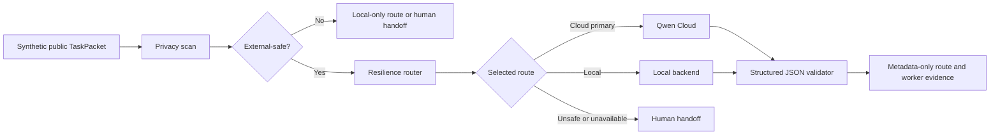

# Qwen Cloud Proof Path

## Purpose

This path gives judges a direct, optional Qwen Cloud demonstration while keeping
the normal reviewer quickstart credential-free.

The proof uses:

- a synthetic public task
- an explicit `novel_design` operator-intent marker
- the existing privacy scanner
- `ExternalSafeTaskPacket` conversion
- the existing resilience router
- the Qwen Cloud backend adapter
- structured JSON validation
- privacy-safe route and worker evidence

## Architecture



The Qwen adapter is never invoked unless the task first becomes an
`ExternalSafeTaskPacket`.

## Configuration

Use environment variables. Do not put the API key in the repository.

```powershell
$env:TRIAGE_QWEN_ENABLED="true"
$env:TRIAGE_QWEN_API_KEY="<operator-supplied-key>"
$env:TRIAGE_QWEN_MODEL="qwen-max"
```

The default endpoint is the Alibaba Cloud Model Studio OpenAI-compatible
endpoint already configured by TriageCore. Override it only when required:

```powershell
$env:TRIAGE_QWEN_BASE_URL="https://dashscope-intl.aliyuncs.com/compatible-mode/v1"
```

## Run

```powershell
python -m triage_core.qwen_demo
```

For machine-readable evidence:

```powershell
python -m triage_core.qwen_demo --json
```

Then inspect the persisted metadata:

```powershell
tc audit --kind route_audit --last 10
```

## Expected Evidence

The command prints:

- privacy level: `external_safe`
- selected route: `cloud_primary`
- selected backend: `qwen`
- model
- validation result
- elapsed time
- input, output, and total token counts
- the response to the synthetic public task

The ledger stores route and worker metadata. It does not store the demo prompt,
input data, or Qwen response body.

## Credential-Free Verification

The automated test uses a mocked Qwen backend:

```powershell
python -m pytest tests/test_qwen_demo.py -q
python -m pytest tests/test_qwen_backend.py tests/test_qwen_cloud_routing.py -q
```

## Claim Boundaries

This proof demonstrates:

- a real Qwen Cloud execution path when operator credentials are present
- explicit public-data eligibility before cloud execution
- structured output validation
- privacy-safe route evidence

It does not demonstrate:

- production-scale throughput
- autonomous cloud fallback
- private-data cloud processing
- completed MCP integration
- completed environmental deployment
